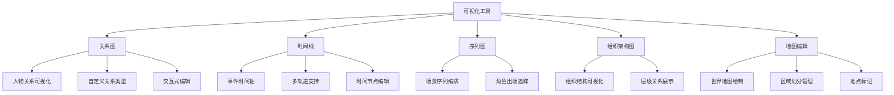

# NanamiNovelHelper

<p align="center">
  <strong>面向小说创作者的专业写作辅助工具</strong>
</p>

<p align="center">
  <a href="#核心功能">核心功能</a> •
  <a href="#技术栈">技术栈</a> •
  <a href="#安装指南">安装指南</a> •
  <a href="#开发指南">开发指南</a> •
  <a href="#贡献规范">贡献规范</a>
</p>

***

## 项目概述

NanamiNovelHelper 是一款基于 Tauri v2 构建的跨平台桌面应用，专为小说创作者设计。它集成了项目管理、智能编辑器、词汇管理、关系图、时间线、组织架构图、地图编辑、Git版本控制、AI辅助等丰富功能，帮助作者更高效地进行创作。

### 设计理念

- **本地优先**：所有数据存储在本地，保护创作隐私
- **专业工具**：提供小说创作所需的各类辅助工具
- **高效体验**：基于 Tauri 的原生性能，启动快速、响应流畅
- **可扩展性**：支持动态技能系统，可自定义 Python 脚本扩展功能

### 使用须知

> 🍵 这软件主要是为了方便我自己而捣鼓出来的，所以……
>
> - 功能可能会有各种奇怪的 bug
> - Issue 看到了可能会修，~~也可能懒得修~~
> - 如果你也觉得好用，那真是太好了；如果遇到问题……欸嘿

***

## 核心功能

### 📝 智能编辑器

- 基于 TipTap 构建的富文本编辑器
- 支持 Markdown 语法
- 词汇高亮与悬浮提示
- 敏感词检测与标记
- 图片粘贴与智能压缩
- 智能链接识别
- 任务列表支持
- 搜索替换功能

### 📚 词汇管理

- 自定义词汇类型与字段
- 批量编辑与导入导出
- 多条件筛选与排序
- 表格视图配置
- 词汇统计与分析

### 🔗 可视化工具



### 🔄 Git 版本控制

- 自动检测项目 `.git` 目录
- 可视化变更管理
- 提交历史浏览
- 分支管理
- 差异对比
- 自动提交功能

### 🤖 AI 辅助

- 支持多种 AI 提供商（OpenAI、Anthropic、DeepSeek 等）
- 会话管理
- 快捷操作：润色、续写、逻辑检查、生成摘要、角色分析
- AI 文件工具：自动读取项目文件、搜索小说内容
- AI 编辑 Diff 对比：修改建议以 Diff 形式展示，支持接受或拒绝

### 🖥️ 终端集成

- 内置终端面板
- 多终端实例支持
- 自定义 Shell 配置

### ⚙️ 其他功能

- 项目管理与最近项目列表
- 随机姓名生成器
- 全局搜索
- 数据备份与恢复
- 自定义快捷键
- 主题与外观设置

***

## 技术栈

### 前端

| 技术               | 版本   | 用途     |
| :--------------- | :--- | :----- |
| React            | 18.3 | UI 框架  |
| TypeScript       | 5.7  | 类型安全   |
| Ant Design       | 5.22 | UI 组件库 |
| Zustand          | 5.0  | 状态管理   |
| TipTap           | 2.10 | 富文本编辑器 |
| CodeMirror       | 6    | 代码编辑器  |
| PixiJS           | 8.17 | 地图渲染引擎 |
| @antv/g6         | 5.0  | 图可视化   |
| xterm.js         | 6.0  | 终端模拟器  |
| @dnd-kit         | -    | 拖拽功能   |
| react-router-dom | 7.1  | 路由管理   |

### 后端 (Rust)

| Crate        | 版本   | 用途       |
| :----------- | :--- | :------- |
| tauri        | 2    | 应用框架     |
| tokio        | 1    | 异步运行时    |
| serde        | 1.0  | 序列化      |
| reqwest      | 0.12 | HTTP 客户端 |
| image        | 0.25 | 图像处理     |
| keyring      | 3    | 安全存储     |
| notify       | 7    | 文件监视     |
| portable-pty | 0.8  | 伪终端      |
| json5        | 0.4  | JSON5 解析 |

### 构建工具

| 工具       | 用途      |
| :------- | :------ |
| Vite 6   | 前端构建    |
| ESLint 9 | 代码检查    |
| Prettier | 代码格式化   |
| Vitest   | 单元测试    |
| Cargo    | Rust 构建 |

***

## 安装指南

### 系统要求

- **Node.js**: >= 20.0.0
- **Rust**: >= 1.77.2
- **操作系统**: Windows 10/11、macOS 10.15+、Linux

### 环境准备

1. **安装 Node.js**

   推荐使用 [nvm](https://github.com/nvm-sh/nvm) 或 [fnm](https://github.com/Schniz/fnm) 管理 Node.js 版本：
   ```bash
   # 使用 fnm
   fnm install 20
   fnm use 20

   # 或使用 nvm
   nvm install 20
   nvm use 20
   ```
2. **安装 Rust**

   访问 [rustup.rs](https://rustup.rs/) 或运行：
   ```bash
   curl --proto '=https' --tlsv1.2 -sSf https://sh.rustup.rs | sh
   ```
3. **安装 pnpm（推荐）**
   ```bash
   npm install -g pnpm
   ```

### 安装依赖

```bash
# 克隆仓库
git clone https://github.com/NanamiKyoka/NanamiNovelHelper.git
cd NanamiNovelHelper

# 安装依赖
npm install
```

***

## 开发指南

### 开发命令

```bash
# 启动开发服务器（热重载）
npm run dev

# 启动 Tauri 开发模式
npm run tauri:dev

# 类型检查
npm run typecheck

# 代码检查
npm run lint

# 代码检查并自动修复
npm run lint:fix

# 代码格式化
npm run format

# 运行测试
npm run test

# 测试覆盖率
npm run test:coverage

# 构建生产版本
npm run build

# Tauri 生产构建
npm run tauri:build
```

### Rust 开发

```bash
cd src-tauri

# 快速编译检查
cargo check

# 构建调试版本
cargo build

# 构建发布版本
cargo build --release
```

### 质量检查

提交代码前请确保通过以下检查：

```bash
npm run typecheck && npm run lint && npm run test
```

如果快照测试失败，使用以下命令更新：

```bash
npm run test -- -u
```

***

## 项目结构

```
NanamiNovelHelper/
├── src/
│   ├── renderer/           # 前端代码
│   │   ├── src/
│   │   │   ├── components/ # React 组件
│   │   │   ├── stores/     # Zustand 状态管理
│   │   │   ├── services/   # 服务层
│   │   │   ├── hooks/      # 自定义 Hooks
│   │   │   ├── utils/      # 工具函数
│   │   │   ├── types/      # TypeScript 类型
│   │   │   └── constants/  # 常量定义
│   │   ├── index.html      # 主窗口入口
│   │   └── terminal.html   # 终端窗口入口
│   └── shared/             # 前后端共享代码
├── src-tauri/              # Rust 后端
│   ├── src/
│   │   ├── commands/       # Tauri 命令
│   │   ├── services/       # 业务服务
│   │   ├── models/         # 数据模型
│   │   └── utils/          # 工具函数
│   ├── Cargo.toml          # Rust 依赖
│   └── tauri.conf.json     # Tauri 配置
├── tests/                  # 测试文件
├── package.json            # 前端依赖
├── vite.config.ts          # Vite 配置
├── vitest.config.ts        # 测试配置
└── tsconfig.web.json       # TypeScript 配置
```

### 路径别名

| 别名              | 路径                              |
| :-------------- | :------------------------------ |
| `@renderer/*`   | `src/renderer/src/*`            |
| `@components/*` | `src/renderer/src/components/*` |
| `@stores/*`     | `src/renderer/src/stores/*`     |
| `@services/*`   | `src/renderer/src/services/*`   |
| `@hooks/*`      | `src/renderer/src/hooks/*`      |
| `@utils/*`      | `src/renderer/src/utils/*`      |
| `@types/*`      | `src/renderer/src/types/*`      |
| `@constants/*`  | `src/renderer/src/constants/*`  |
| `@shared/*`     | `src/shared/*`                  |

***

## 使用说明

### 创建项目

1. 启动应用后，点击「新建项目」
2. 选择项目保存位置
3. 填写项目名称、描述等信息
4. 点击创建

### 打开项目

- 点击「打开项目」选择项目目录
- 或从「最近项目」列表快速打开
- 支持打开已包含 `.git` 目录的项目，系统会自动检测并启用 Git 功能

### 编辑器使用

- 双击文件树中的文件打开编辑
- 支持多标签页编辑
- 使用工具栏进行格式化操作
- 右键菜单提供更多操作选项

### 词汇管理

1. 在右侧面板打开「词汇管理」
2. 创建词汇类型（如：人物、地点、物品）
3. 添加词汇条目，自定义字段值
4. 编辑器中会自动高亮匹配的词汇

### Git 版本控制

1. 打开包含 `.git` 目录的项目，系统自动检测
2. 或在 Git 面板初始化新仓库
3. 查看文件变更、提交历史
4. 管理分支、合并代码

### AI 辅助

1. 在设置中配置 AI API 密钥
2. 在编辑器中使用 AI 功能

***

## API 文档

### Tauri 命令

项目通过 Tauri IPC 暴露 Rust 服务，前端通过 `window.api` 调用。

#### 项目管理

```typescript
// 创建项目
await window.api.project.create(options: CreateProjectOptions)

// 打开项目
await window.api.project.open(path: string)

// 获取初始化数据
await window.api.project.getInitData()
```

#### Git 操作

```typescript
// 检测是否为 Git 仓库
await window.api.git.isRepo(repoPath: string): boolean

// 获取仓库状态
await window.api.git.status(repoPath: string)

// 提交
await window.api.git.commit(repoPath: string, options: GitCommitOptions)

// 获取提交历史
await window.api.git.log(repoPath: string, options?: GitLogOptions)
```

#### 词汇管理

```typescript
// 获取词汇类型
await window.api.vocabulary.getTypes()

// 获取词汇条目
await window.api.vocabulary.getEntries(typeId?: string)

// 保存词汇数据
await window.api.vocabulary.saveTypes(types: VocabularyType[])
await window.api.vocabulary.saveEntries(entries: VocabularyEntry[])
```

### 动态技能

支持通过 Python 脚本扩展功能：

```typescript
// 执行技能
await window.api.skill.execute(skillId: string, params: any)

// 获取技能列表
await window.api.skill.list()
```

***

## 配置说明

### 编辑器配置

在设置页面可配置：

- 字体大小与字体族
- 行高与段落间距
- 自动保存间隔
- 拼写检查开关

### 外观配置

- 主题模式（亮色/暗色）
- 侧边栏宽度
- 面板布局

### 快捷键

支持自定义快捷键绑定，默认快捷键：

| 功能   | 快捷键            |
| :--- | :------------- |
| 新建项目 | `Ctrl+Shift+N` |
| 打开项目 | `Ctrl+Shift+O` |
| 保存文件 | `Ctrl+S`       |
| 搜索替换 | `Ctrl+H`       |
| 全局搜索 | `Ctrl+Shift+F` |

***

## 贡献规范

### 开发流程

1. Fork 本仓库
2. 创建功能分支：`git checkout -b feature/your-feature`
3. 进行开发并确保通过质量检查
4. 提交代码：使用规范的提交信息
5. 推送分支并创建 Pull Request

### 提交信息规范

```
<type>(<scope>): <subject>

<body>
```

类型：

- `feat`: 新功能
- `fix`: Bug 修复
- `docs`: 文档更新
- `refactor`: 代码重构
- `test`: 测试相关
- `chore`: 构建/工具变更

示例：

```
feat(editor): 新增词汇悬浮提示功能

- 支持鼠标悬浮显示词汇详情
- 添加词汇快速编辑入口
```

### 代码规范

- 无分号（Prettier `semi: false`）
- 无尾逗号（Prettier `trailingComma: none`）
- 箭头函数无括号：`x => x`
- 2 空格缩进
- 单引号
- 100 字符行宽
- LF 换行

***

## 许可证

本项目采用 [MPL-2.0](https://www.mozilla.org/en-US/MPL/2.0/) 许可证。

***

## 联系方式

- **项目主页**: <https://github.com/NanamiKyoka/NanamiNovelHelper>
- **问题反馈**: [GitHub Issues](https://github.com/NanamiKyoka/NanamiNovelHelper/issues)

***

## 致谢

感谢以下开源项目的支持：

- [Tauri](https://tauri.app/) - 跨平台桌面应用框架
- [React](https://react.dev/) - UI 框架
- [Ant Design](https://ant.design/) - UI 组件库
- [TipTap](https://tiptap.dev/) - 富文本编辑器
- [PixiJS](https://pixijs.com/) - 2D 渲染引擎
- [G6](https://g6.antv.antgroup.com/) - 图可视化

